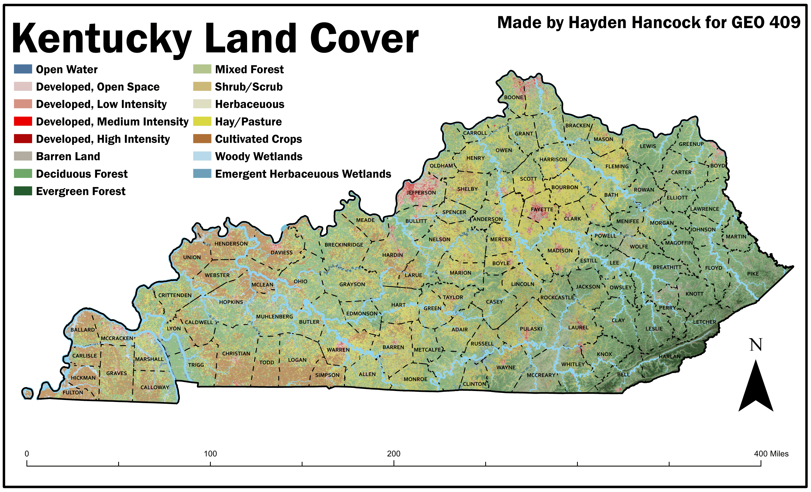
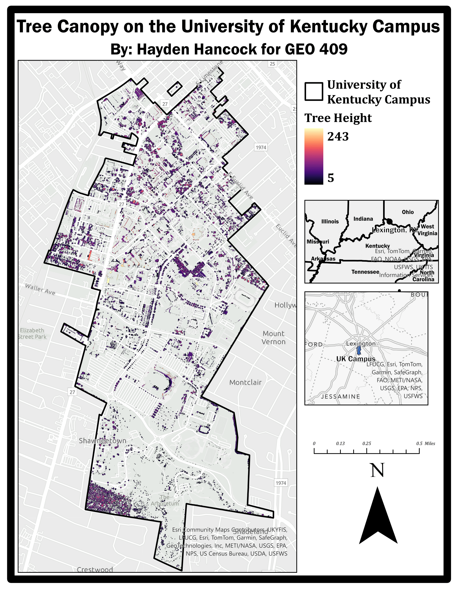

# geo409-mod4-practice

## Practice working with Repos in Module 4 of GEO 409 during Spring 2024

Map that shows land cover from NAIP imagery, paired with streams, counties, and elevation shading.

[Download KY Land Cover PDF](KYLandCover.pdf)

Map that shows canopy across the Univeristy of Kentucky Campus

[Download UK Tree Canopy PDF](UKTreeCanopy.pdf)
